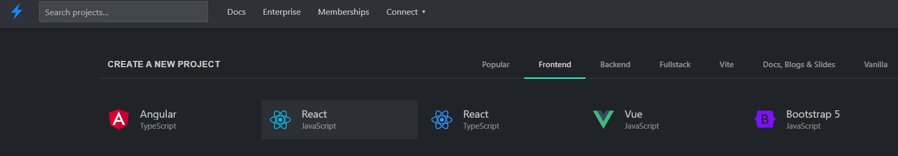

# React Fortnite Cosmetics

This is a basic exercise in React where you can create a UI that requests some data and then renders it.

The concepts you can see here in this exercise:
- How React is mounted in the HTML.
- How to create a component that accepts props and then renders stuff.
- How to fetch data from a React component.
- What is state.

You probably can learn a lot more if you follow [React docs](https://reactjs.org/) or the [New React docs](https://beta.reactjs.org/learn).

There you can have a deep understanding of the key concepts that React implements. Learning React implies learning JavaScript, so you could feel this is too much at the beginning, but don't worry! We've all passed that point and you will too.

---

You can find the slides shared in the same talk here: https://slides.com/lucasbernalte/intro-to-frontend-and-react-with-fortnite/fullscreen

---

# Getting Started

You can set up your own project like this with [Vite](https://vitejs.dev/).

Vite is a build tool that aims to provide a faster and leaner development experience for modern web projects. You can start a React project with Vite or you can use another tool like [Create-React-App](https://create-react-app.dev/) or similar.

## Steps to init a React project with Vite

1. `npm init vite@latest`
2. Choose a name for your project.
3. Choose react, and then react again (they give you the option of using TypeScript as well, but choose the regular one, that uses JavaScript).
4. Enter the directory (the name you set in step 2) that was just created and do `npm install`.
5. Run `npm run dev`.
6. You should see a URL in the console (likely it is http://localhost:3000). Go to that URL in the browser. There you go!

## Creating a project in StackBlitz

Create a project with the template React JavaScript

---

# Steps

1. Create a card component and render it in the app.
2. Consume Fortnite API for cosmetics: https://fortnite-api.com/v2/cosmetics/br/new
3. Render the list of cosmetics using the component we created.

---

# Other resources:

- [StackBlitz](https://stackblitz.com/)
- [CSS Box Shadow examples](https://getcssscan.com/css-box-shadow-examples)